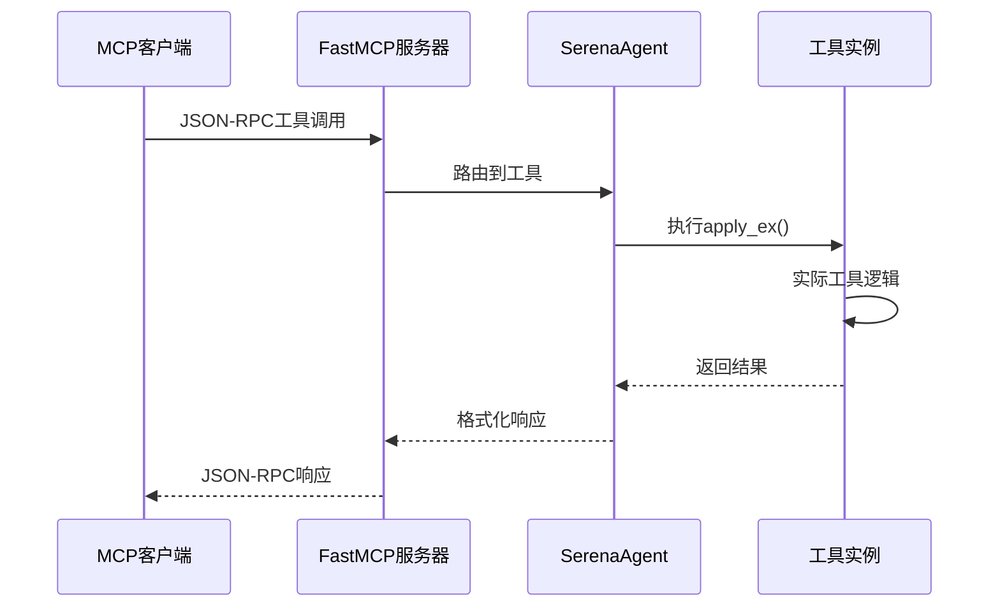
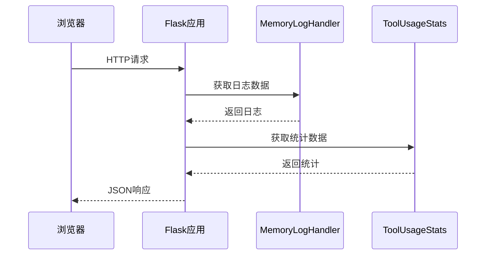
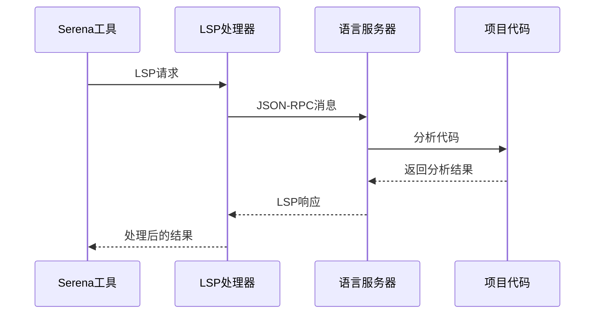

# ☕ Serena 网络API接口文档

## 📋 接口识别概览

Serena项目包含以下主要网络API接口：

1. **MCP协议接口** - 模型上下文协议服务器
2. **Web仪表板API** - Flask Web服务接口
3. **LSP协议接口** - 语言服务器协议通信
4. **JetBrains插件API** - IDE插件通信接口

## 🌐 MCP协议接口

### 接口信息
- **基础路径**：通过stdio/SSE传输，无固定HTTP路径
- **协议类型**：JSON-RPC 2.0
- **传输方式**：stdio (标准输入输出) / SSE (Server-Sent Events)
- **权限要求**：客户端启动服务器

### MCP工具接口

#### 1.1 工具调用接口

**接口描述**：执行Serena工具的统一入口
**调用方式**：JSON-RPC 2.0 over stdio/SSE

**请求格式**：
```json
{
  "jsonrpc": "2.0",
  "id": "request_id",
  "method": "tools/call",
  "params": {
    "name": "tool_name",
    "arguments": {
      "param1": "value1",
      "param2": "value2"
    }
  }
}
```

**响应格式**：
```json
{
  "jsonrpc": "2.0",
  "id": "request_id",
  "result": {
    "content": [
      {
        "type": "text",
        "text": "工具执行结果"
      }
    ]
  }
}
```

#### 1.2 工具列表接口

**请求示例**：
```json
{
  "jsonrpc": "2.0",
  "id": "list_tools",
  "method": "tools/list"
}
```

**响应示例**：
```json
{
  "jsonrpc": "2.0",
  "id": "list_tools",
  "result": {
    "tools": [
      {
        "name": "find_symbol",
        "description": "查找代码符号",
        "inputSchema": {
          "type": "object",
          "properties": {
            "symbol_name": {"type": "string"},
            "symbol_type": {"type": "string"}
          }
        }
      }
    ]
  }
}
```

## 🎛️ Web仪表板API

### 接口信息
- **基础路径**：`http://localhost:24282`
- **协议类型**：HTTP REST API
- **框架**：Flask
- **权限要求**：本地访问

### 2.1 获取日志消息

**接口地址**：`/get_log_messages`
**请求方法**：`POST`
**接口描述**：获取系统日志消息，支持分页查询

**请求参数**：
| 参数名 | 类型 | 必选 | 描述 | 示例值 |
|--------|------|------|------|--------|
| start_idx | int | 否 | 起始索引 | `0` |

**请求示例**：
```json
{
  "start_idx": 0
}
```

**响应参数**：
| 参数名 | 类型 | 描述 |
|--------|------|------|
| messages | array | 日志消息列表 |
| max_idx | int | 最大索引值 |

**成功响应示例**：
```json
{
  "messages": [
    {
      "timestamp": "2024-01-01T10:00:00",
      "level": "INFO",
      "message": "MCP server started",
      "logger": "serena.mcp"
    }
  ],
  "max_idx": 100
}
```

### 2.2 获取工具名称列表

**接口地址**：`/get_tool_names`
**请求方法**：`GET`
**接口描述**：获取所有可用工具的名称列表

**响应示例**：
```json
{
  "tool_names": [
    "find_symbol",
    "read_file",
    "execute_shell_command",
    "write_memory"
  ]
}
```

### 2.3 获取工具使用统计

**接口地址**：`/get_tool_stats`
**请求方法**：`GET`
**接口描述**：获取工具使用统计信息

**响应示例**：
```json
{
  "stats": {
    "find_symbol": {
      "call_count": 15,
      "total_tokens": 1250,
      "avg_tokens": 83.3,
      "last_used": "2024-01-01T10:30:00"
    },
    "read_file": {
      "call_count": 8,
      "total_tokens": 2400,
      "avg_tokens": 300,
      "last_used": "2024-01-01T10:25:00"
    }
  }
}
```

### 2.4 清除工具统计

**接口地址**：`/clear_tool_stats`
**请求方法**：`POST`
**接口描述**：清除所有工具使用统计数据

**响应示例**：
```json
{
  "status": "cleared"
}
```

### 2.5 关闭服务器

**接口地址**：`/shutdown`
**请求方法**：`PUT`
**接口描述**：远程关闭Serena服务器

**响应示例**：
```json
{
  "status": "shutting down"
}
```

### 2.6 静态文件服务

**接口地址**：`/dashboard/<path:filename>`
**请求方法**：`GET`
**接口描述**：提供仪表板静态文件服务

**示例URL**：
- `http://localhost:24282/dashboard/index.html`
- `http://localhost:24282/dashboard/dashboard.js`
- `http://localhost:24282/dashboard/dashboard.css`

## 🔌 LSP协议接口

### 接口信息
- **协议类型**：Language Server Protocol (LSP)
- **传输方式**：JSON-RPC over stdio
- **权限要求**：进程间通信

### 3.1 LSP初始化

**方法**：`initialize`
**描述**：初始化语言服务器连接

**请求示例**：
```json
{
  "jsonrpc": "2.0",
  "id": 1,
  "method": "initialize",
  "params": {
    "processId": 12345,
    "rootPath": "/path/to/project",
    "capabilities": {
      "textDocument": {
        "hover": {"dynamicRegistration": true},
        "definition": {"dynamicRegistration": true}
      }
    }
  }
}
```

### 3.2 文档符号查询

**方法**：`textDocument/documentSymbol`
**描述**：获取文档中的符号信息

**请求示例**：
```json
{
  "jsonrpc": "2.0",
  "id": 2,
  "method": "textDocument/documentSymbol",
  "params": {
    "textDocument": {
      "uri": "file:///path/to/file.py"
    }
  }
}
```

### 3.3 查找引用

**方法**：`textDocument/references`
**描述**：查找符号的所有引用位置

**请求示例**：
```json
{
  "jsonrpc": "2.0",
  "id": 3,
  "method": "textDocument/references",
  "params": {
    "textDocument": {
      "uri": "file:///path/to/file.py"
    },
    "position": {
      "line": 10,
      "character": 5
    },
    "context": {
      "includeDeclaration": true
    }
  }
}
```

## 🔧 JetBrains插件API

### 接口信息
- **基础路径**：`http://localhost:8080`
- **协议类型**：HTTP REST API
- **权限要求**：本地IDE插件

### 4.1 符号搜索接口

**接口地址**：`/api/symbols/search`
**请求方法**：`POST`
**接口描述**：在项目中搜索符号

**请求示例**：
```json
{
  "query": "MyClass",
  "type": "class",
  "scope": "project"
}
```

**响应示例**：
```json
{
  "symbols": [
    {
      "name": "MyClass",
      "type": "class",
      "file": "/src/main.py",
      "line": 15,
      "column": 7
    }
  ]
}
```

## 📊 接口调用关系分析

### MCP服务器调用流程



### Web仪表板调用流程



### LSP协议调用流程



## 🔗 接口业务逻辑分析

### 核心业务流程

#### 1. 工具执行业务逻辑
```
客户端请求 → MCP协议解析 → 工具路由 → 权限检查 → 项目验证 → 语言服务器调用 → 结果返回
```

#### 2. 日志监控业务逻辑
```
系统日志 → 内存处理器 → Web API → 前端轮询 → 实时显示
```

#### 3. 符号分析业务逻辑
```
符号查询 → LSP请求 → 语言服务器 → 代码分析 → 符号信息 → 结果缓存
```

### 关键函数调用链

#### MCP工具调用链 `[src/serena/mcp.py:94-118]`
```python
def make_mcp_tool(self, tool: Tool) -> MCPTool:
    # 1. 获取工具函数
    apply_fn = tool.get_apply_fn()
    
    # 2. 创建执行函数
    def execute_fn(**kwargs) -> str:
        return tool.apply_ex(**kwargs)
    
    # 3. 生成MCP工具
    return MCPTool(
        fn=execute_fn,
        name=tool.get_name(),
        description=tool_doc,
        parameters=parameters
    )
```

#### Web仪表板API `[src/serena/dashboard.py:107-116]`
```python
@self._app.route("/get_log_messages", methods=["POST"])
def get_log_messages() -> dict[str, Any]:
    request_data = request.get_json()
    request_log = RequestLog.model_validate(request_data)
    result = self._get_log_messages(request_log)
    return result.model_dump()
```

#### LSP协议处理 `[src/solidlsp/ls_handler.py:425-438]`
```python
def send_request_and_wait_for_response(self, method: str, params: dict) -> Any:
    request_id = self._get_next_request_id()
    request = LanguageServerRequest(request_id)
    
    # 发送请求
    self._send_payload(make_request(method, request_id, params))
    
    # 等待响应
    result = request.get_result(timeout=self._request_timeout)
    
    return result.payload
```

---

*参考文件：mcp.py, dashboard.py, ls_handler.py, jetbrains_plugin_client.py*
