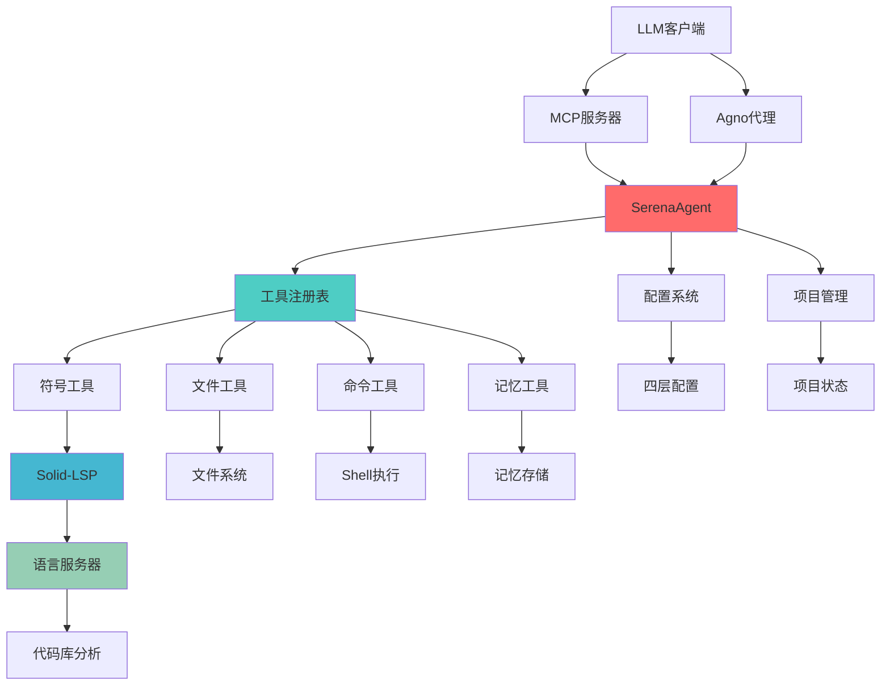
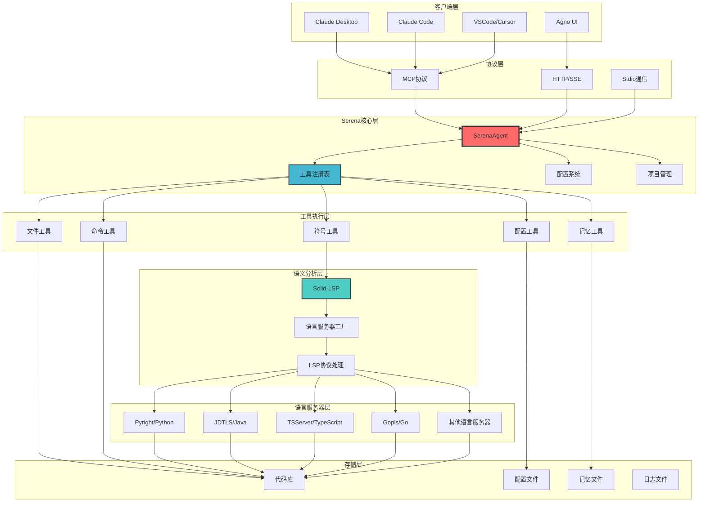
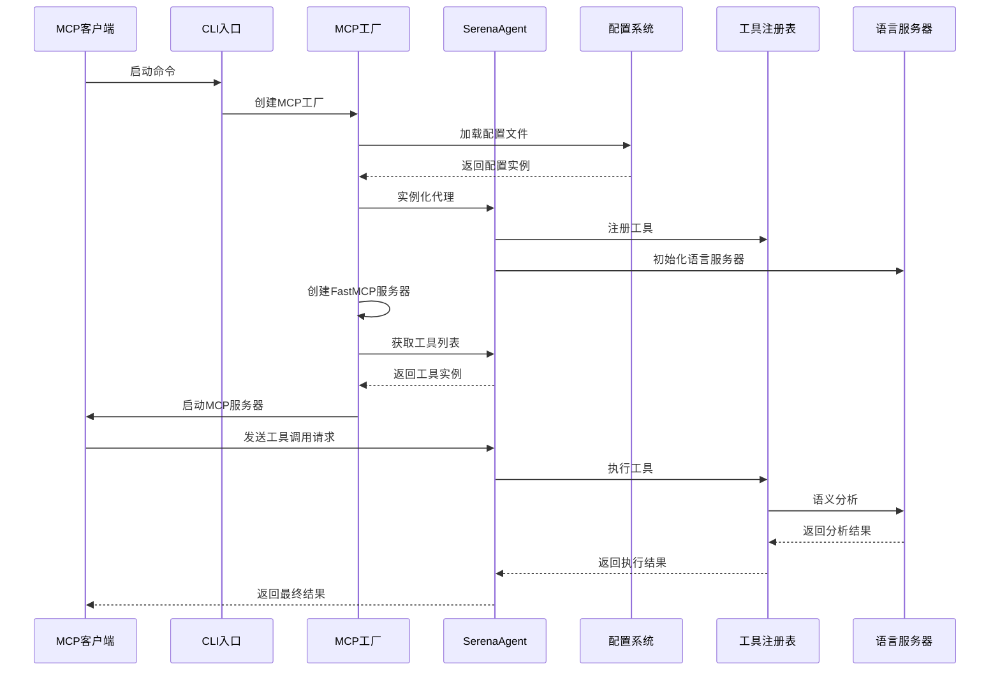

# 🏗️ Serena 架构分析

## 📋 模块划分

### 1. 核心模块 (src/serena/)

#### 🎯 代理核心层
- **agent.py** `[src/serena/agent.py:96-184]` - SerenaAgent核心类，负责工具管理、项目激活、语言服务器集成
- **mcp.py** `[src/serena/mcp.py:94-179]` - MCP服务器实现，提供FastMCP集成和工具转换
- **agno.py** `[src/serena/agno.py]` - Agno框架集成，支持模型无关的代理实现

#### ⚙️ 配置管理层
- **config/serena_config.py** `[src/serena/config/serena_config.py:40-363]` - 主配置系统，四层配置架构
- **config/context_mode.py** `[src/serena/config/context_mode.py]` - 上下文和模式定义系统
- **project.py** `[src/serena/project.py]` - 项目管理和配置

#### 🔧 工具系统层
- **tools/tools_base.py** `[src/serena/tools/tools_base.py:323-340]` - 工具基类和注册表系统
- **tools/symbol_tools.py** `[src/serena/tools/symbol_tools.py]` - 符号级代码操作工具
- **tools/file_tools.py** `[src/serena/tools/file_tools.py]` - 文件系统操作工具
- **tools/cmd_tools.py** `[src/serena/tools/cmd_tools.py:31-43]` - Shell命令执行工具
- **tools/memory_tools.py** `[src/serena/tools/memory_tools.py]` - 记忆管理工具

#### 🌐 界面和监控层
- **dashboard.py** `[src/serena/dashboard.py]` - Web仪表板，提供日志查看和监控
- **gui_log_viewer.py** `[src/serena/gui_log_viewer.py]` - GUI日志查看器
- **cli.py** `[src/serena/cli.py:129-163]` - 命令行接口

### 2. 语言服务器集成层 (src/solidlsp/)

#### 🔌 LSP核心
- **ls.py** `[src/solidlsp/ls.py:119-178]` - 语言服务器工厂，支持多种编程语言
- **ls_handler.py** `[src/solidlsp/ls_handler.py]` - LSP协议处理器
- **ls_config.py** `[src/solidlsp/ls_config.py]` - 语言服务器配置

#### 🌍 多语言支持
- **language_servers/** - 各语言服务器实现
  - Python: Pyright/Jedi `[src/solidlsp/ls.py:120-129]`
  - Java: Eclipse JDTLS `[src/solidlsp/ls.py:130-135]`
  - TypeScript: TSServer/VTS `[src/solidlsp/ls.py:163-169]`
  - Go: Gopls `[src/solidlsp/ls.py:170-173]`
  - Ruby: Solargraph `[src/solidlsp/ls.py:175-178]`

### 3. 提示模板系统 (src/interprompt/)

- **prompt_factory.py** `[src/interprompt/prompt_factory.py]` - 提示工厂和模板管理
- **jinja_template.py** `[src/interprompt/jinja_template.py]` - Jinja2模板引擎集成
- **multilang_prompt.py** `[src/interprompt/multilang_prompt.py]` - 多语言提示支持

## 🔗 依赖关系分析

### 核心依赖流向

```
LLM客户端 → MCP协议 → SerenaAgent → 工具系统 → 语言服务器 → 代码库
    ↓           ↓          ↓          ↓           ↓
Claude Desktop  FastMCP   Tool类    LSP协议    文件系统
Agno UI        HTTP/SSE   注册表    符号分析    Git仓库
```

### 模块间依赖关系



## 🏛️ 整体架构图



## ⏱️ 时序图 - MCP服务器启动流程



## 🔄 核心调用流程

### MCP模式调用流程
```
客户端请求 → MCP协议 → FastMCP → SerenaAgent → 工具执行 → LSP分析 → 结果返回
```

### Agno模式调用流程  
```
LLM请求 → Agno框架 → SerenaAgnoToolkit → SerenaAgent → 工具执行 → 结果返回
```

### 工具执行流程
```
工具调用 → 权限检查 → 项目验证 → 语言服务器启动 → 实际执行 → 缓存保存 → 结果返回
```

## 🔧 技术栈详解

### 核心依赖库

#### 前端技术栈
```
Flask = "^3.0.0"           # Web框架，用于仪表板
Jinja2 = "^3.1.6"          # 模板引擎
```

#### 后端核心
```
mcp = "^1.5.0"             # 模型上下文协议SDK
pydantic = "^2.10.6"       # 数据验证和序列化
requests = "^2.32.3"       # HTTP客户端
psutil = "^7.0.0"          # 系统进程管理
```

#### 语言服务器集成
```
pyright = "^1.1.396"       # Python类型检查器
overrides = "^7.7.0"       # 方法重写装饰器
```

#### 配置和模板
```
pyyaml = "^6.0.2"          # YAML配置解析
ruamel.yaml = "^0.18.0"    # 保留注释的YAML处理
jinja2 = "^3.1.6"          # 模板引擎
```

#### 工具和实用程序
```
tqdm = "^4.67.1"           # 进度条
joblib = "^1.5.1"          # 并行处理
pathspec = "^0.12.1"       # 路径匹配(gitignore风格)
docstring_parser = "^0.16" # 文档字符串解析
```

#### 可选依赖
```
agno = "^1.2.6"            # 模型无关代理框架
anthropic = "^0.49.0"      # Anthropic API客户端
google-genai = "^1.8.0"    # Google Gemini API客户端
tiktoken = "^0.9.0"        # Token计数器
```

### 开发工具链
```
black = "^23.7.0"          # 代码格式化
ruff = "^0.0.285"          # 代码检查
mypy = "^1.16.1"           # 静态类型检查
pytest = "^8.0.2"          # 测试框架
poethepoet = "^0.20.0"     # 任务运行器
```

## 🏗️ 设计模式分析

### 1. 工厂模式
- **SerenaMCPFactory** `[src/serena/mcp.py:124-179]` - MCP服务器工厂
- **SolidLanguageServer.create()** `[src/solidlsp/ls.py:119-178]` - 语言服务器工厂

### 2. 单例模式
- **ToolRegistry** `[src/serena/tools/tools_base.py:323-334]` - 工具注册表单例
- **SerenaConfig** - 配置管理单例

### 3. 策略模式
- **Tool基类** `[src/serena/tools/tools_base.py:99-266]` - 不同工具的策略实现
- **LanguageServer** - 不同语言的LSP策略

### 4. 观察者模式
- **MemoryLogHandler** `[src/serena/dashboard.py:73-94]` - 日志观察者
- **Web仪表板** - 实时日志监控

### 5. 适配器模式
- **SerenaAgnoToolkit** `[src/serena/agno.py]` - Agno框架适配器
- **MCP工具适配器** `[src/serena/mcp.py:94-105]` - 工具到MCP的适配

## 🔄 数据流向分析

### 配置数据流
```
模板文件 → 用户配置 → 运行时配置 → 工具激活状态
```

### 工具执行数据流
```
LLM请求 → MCP解析 → 工具路由 → 权限检查 → 实际执行 → 结果返回
```

### 语义分析数据流
```
代码文件 → LSP分析 → 符号提取 → 缓存存储 → 查询响应
```

### 日志监控数据流
```
系统事件 → 日志处理器 → 内存缓存 → Web API → 前端显示
```

---

*参考文件：agent.py, mcp.py, tools_base.py, ls.py, dashboard.py, pyproject.toml 等核心模块*
