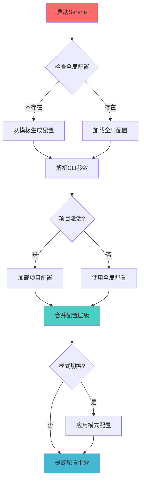
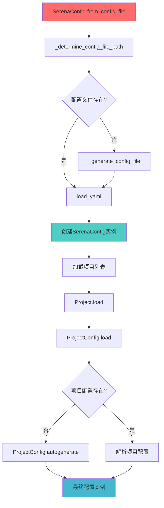
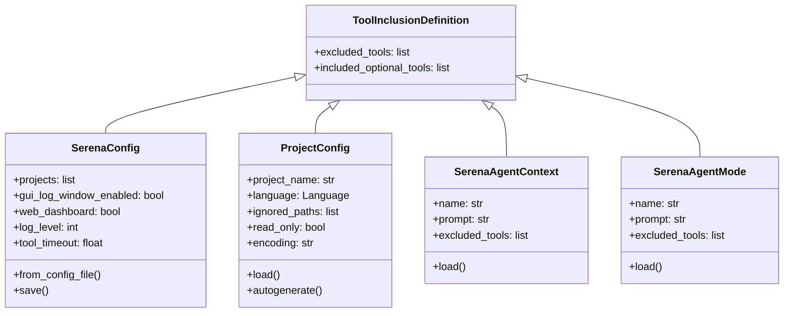

# ⚙️ Serena 配置系统分析

## 📋 配置系统概览

Serena采用**四层配置架构**，提供灵活的配置管理和运行时行为调整：

1. **全局配置** - `serena_config.yml`
2. **CLI参数** - 运行时覆盖
3. **项目配置** - `.serena/project.yml`
4. **活动模式** - 运行时行为修改

## 🗂️ 配置文件结构

### 1. 全局配置文件 (serena_config.yml)

**位置**：`~/.serena/serena_config.yml` (用户主目录)
**Docker模式**：`/serena_config.yml` (项目根目录)

#### 配置字段说明

| 字段名 | 类型 | 默认值 | 描述 |
|--------|------|--------|------|
| `gui_log_window` | bool | `False` | 是否启用GUI日志窗口 |
| `web_dashboard` | bool | `True` | 是否启用Web仪表板 |
| `web_dashboard_open_on_launch` | bool | `True` | 启动时是否自动打开仪表板 |
| `log_level` | int | `20` | 日志级别(10=DEBUG, 20=INFO, 30=WARNING, 40=ERROR) |
| `trace_lsp_communication` | bool | `False` | 是否跟踪LSP通信 |
| `tool_timeout` | float | `240` | 工具执行超时时间(秒) |
| `excluded_tools` | list | `[]` | 全局排除的工具列表 |
| `included_optional_tools` | list | `[]` | 包含的可选工具列表 |
| `jetbrains` | bool | `False` | 是否启用JetBrains模式 |
| `record_tool_usage_stats` | bool | `False` | 是否记录工具使用统计 |
| `token_count_estimator` | str | `TIKTOKEN_GPT4O` | Token计数估算器 |
| `projects` | list | `[]` | 注册的项目列表 |

#### 完整配置文件示例

```yaml
# GUI和Web界面配置
gui_log_window: False
web_dashboard: True
web_dashboard_open_on_launch: True

# 日志配置
log_level: 20  # INFO级别
trace_lsp_communication: False

# 工具配置
tool_timeout: 240
excluded_tools: []
included_optional_tools: []

# 特殊模式
jetbrains: False

# 统计配置
record_tool_usage_stats: False
token_count_estimator: TIKTOKEN_GPT4O

# 项目管理(由Serena自动维护)
projects: []
```

### 2. 项目配置文件 (.serena/project.yml)

**位置**：`{项目根目录}/.serena/project.yml`

#### 配置字段说明

| 字段名 | 类型 | 默认值 | 描述 |
|--------|------|--------|------|
| `project_name` | str | 目录名 | 项目名称 |
| `language` | str | `python` | 项目主要编程语言 |
| `ignore_all_files_in_gitignore` | bool | `true` | 是否使用gitignore规则 |
| `ignored_paths` | list | `[]` | 额外忽略的路径列表 |
| `read_only` | bool | `false` | 是否为只读模式 |
| `excluded_tools` | list | `[]` | 项目级排除的工具 |
| `included_optional_tools` | list | `[]` | 项目级包含的可选工具 |
| `initial_prompt` | str | `""` | 项目初始提示 |
| `encoding` | str | `utf-8` | 文件编码 |

#### 完整项目配置示例

```yaml
# 项目基本信息
project_name: "serena"
language: python
encoding: utf-8

# 文件忽略配置
ignore_all_files_in_gitignore: true
ignored_paths:
  - "*.log"
  - "temp/**"
  - "__pycache__/**"

# 访问控制
read_only: false

# 工具配置
excluded_tools: []
included_optional_tools: []

# 项目特定提示
initial_prompt: "这是Serena项目，一个强大的编码代理工具包。"
```

### 3. 支持的编程语言

| 语言 | 配置值 | 语言服务器 | 特殊要求 |
|------|--------|------------|----------|
| Python | `python` | Pyright/Jedi | 无 |
| TypeScript/JavaScript | `typescript` | TSServer/VTS | 无 |
| Java | `java` | Eclipse JDTLS | 启动较慢 |
| C# | `csharp` | OmniSharp | 需要.sln文件 |
| Rust | `rust` | rust-analyzer | 无 |
| Go | `go` | Gopls | 需要安装go和gopls |
| C/C++ | `cpp` | clangd | 可能有引用查找问题 |
| PHP | `php` | Intelephense | 无 |
| Ruby | `ruby` | Solargraph | 未充分测试 |
| Elixir | `elixir` | NextLS | Windows不支持 |
| Clojure | `clojure` | clojure-lsp | 无 |

## 🌍 环境变量

### MCP服务器环境变量

| 变量名 | 默认值 | 描述 |
|--------|--------|------|
| `FASTMCP_HOST` | `0.0.0.0` | MCP服务器监听地址 |
| `FASTMCP_PORT` | `8000` | MCP服务器监听端口 |
| `FASTMCP_LOG_LEVEL` | `INFO` | FastMCP日志级别 |

### 语言服务器环境变量

| 变量名 | 默认值 | 描述 |
|--------|--------|------|
| `SERENA_LSP_TIMEOUT` | `30` | LSP操作超时时间 |
| `SERENA_LSP_CACHE_DIR` | `~/.multilspy` | LSP缓存目录 |

### .env.sample 示例

```bash
# MCP服务器配置
FASTMCP_HOST=0.0.0.0
FASTMCP_PORT=8000
FASTMCP_LOG_LEVEL=INFO

# 语言服务器配置
SERENA_LSP_TIMEOUT=30
SERENA_LSP_CACHE_DIR=~/.multilspy

# 开发环境配置
SERENA_DEV_MODE=false
SERENA_DEBUG_LSP=false

# 可选：API密钥(用于token统计)
ANTHROPIC_API_KEY=your_api_key_here
OPENAI_API_KEY=your_api_key_here
```

## 🔄 配置加载流程

### 配置加载优先级



### 配置加载函数调用关系



### 配置加载代码流程

```python
# 1. 全局配置加载 [src/serena/config/serena_config.py:309-363]
@classmethod
def from_config_file(cls, generate_if_missing: bool = True) -> "SerenaConfig":
    config_file_path = cls._determine_config_file_path()
    
    # 生成配置文件(如果不存在)
    if not os.path.exists(config_file_path):
        if generate_if_missing:
            cls._generate_config_file(config_file_path)
    
    # 加载配置
    loaded_commented_yaml = load_yaml(config_file_path, preserve_comments=True)
    instance = cls(loaded_commented_yaml=loaded_commented_yaml, 
                   config_file_path=config_file_path)
    
    # 加载项目列表
    for path in loaded_commented_yaml["projects"]:
        project = Project.load(path)
        instance.projects.append(project)
    
    return instance

# 2. 项目配置加载 [src/serena/config/serena_config.py:216-231]
@classmethod
def load(cls, project_root: Path | str, autogenerate: bool = True) -> Self:
    project_root = Path(project_root)
    yaml_path = project_root / cls.rel_path_to_project_yml()
    
    if not yaml_path.exists():
        if autogenerate:
            return cls.autogenerate(project_root)
        else:
            raise FileNotFoundError(f"Project configuration file not found: {yaml_path}")
    
    with open(yaml_path, encoding="utf-8") as f:
        yaml_data = yaml.safe_load(f)
    
    return cls._from_dict(yaml_data)
```

## 🎛️ 命令行参数

### MCP服务器启动参数

| 参数 | 类型 | 默认值 | 描述 |
|------|------|--------|------|
| `--project` | str | None | 项目路径或名称 |
| `--context` | str | `desktop-app` | 运行上下文 |
| `--mode` | str | `[]` | 运行模式(可多个) |
| `--transport` | str | `stdio` | 传输协议(stdio/sse) |
| `--host` | str | `0.0.0.0` | 监听地址 |
| `--port` | int | `8000` | 监听端口 |
| `--enable-web-dashboard` | bool | None | 启用Web仪表板 |
| `--enable-gui-log-window` | bool | None | 启用GUI日志窗口 |
| `--log-level` | str | None | 日志级别 |
| `--trace-lsp-communication` | bool | None | 跟踪LSP通信 |
| `--tool-timeout` | float | None | 工具超时时间 |

### 命令行使用示例

```bash
# 基本启动
uv run serena-mcp-server

# 指定项目和上下文
uv run serena-mcp-server --project /path/to/project --context ide-assistant

# 多模式启动
uv run serena-mcp-server --mode planning --mode interactive

# SSE模式启动
uv run serena-mcp-server --transport sse --port 9121

# 调试模式
uv run serena-mcp-server --log-level DEBUG --trace-lsp-communication

# 完整参数示例
uv run serena-mcp-server \
  --project /home/user/myproject \
  --context ide-assistant \
  --mode planning \
  --mode interactive \
  --transport stdio \
  --enable-web-dashboard \
  --log-level INFO \
  --tool-timeout 300
```

## 🔧 配置系统架构

### 配置类层次结构



---

*参考文件：serena_config.py, context_mode.py, project.py, serena_config.template.yml, project.template.yml*
