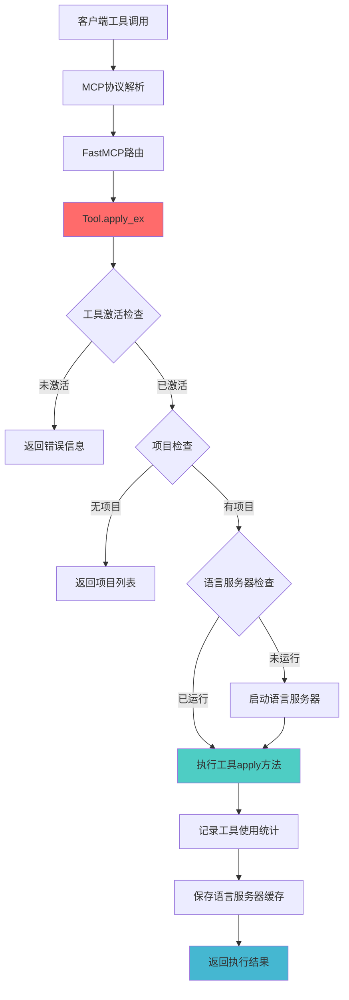
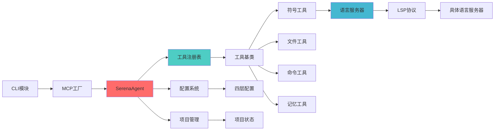

# 🔗 Serena 函数调用分析

## 🎯 核心函数识别

### 1. 主要入口函数

#### CLI入口点
- **start_mcp_server()** `[src/serena/cli.py:129-163]` - MCP服务器启动入口
- **index_project()** `[src/serena/cli.py]` - 项目索引工具
- **print_system_prompt()** `[src/serena/cli.py]` - 系统提示打印工具

#### 核心代理类
- **SerenaAgent.__init__()** `[src/serena/agent.py:96-184]` - 代理初始化，工具注册
- **SerenaAgent.get_exposed_tool_instances()** `[src/serena/agent.py]` - 获取暴露的工具实例
- **SerenaAgent._update_active_tools()** `[src/serena/agent.py:303-320]` - 更新活跃工具集

### 2. 关键工具函数

#### 工具基础设施
- **Tool.apply_ex()** `[src/serena/tools/tools_base.py:211-266]` - 工具执行核心方法
- **ToolRegistry.__init__()** `[src/serena/tools/tools_base.py:323-334]` - 工具注册表初始化
- **ToolRegistry.get_all_tool_classes()** `[src/serena/tools/tools_base.py:339-340]` - 获取所有工具类

#### 语言服务器集成
- **SolidLanguageServer.create()** `[src/solidlsp/ls.py:119-178]` - 语言服务器工厂方法
- **LanguageServerSymbolRetriever** `[src/serena/symbol.py]` - 符号检索器

### 3. 工具函数分类

#### 符号操作工具 (symbol_tools.py)
- **FindSymbolTool.apply()** - 全局符号搜索
- **FindReferencingSymbolsTool.apply()** - 查找符号引用
- **GetSymbolsOverviewTool.apply()** - 获取符号概览

#### 文件操作工具 (file_tools.py)
- **ReadFileTool.apply()** - 文件读取
- **CreateTextFileTool.apply()** - 文件创建
- **DeleteLinesTool.apply()** - 行删除

#### 命令执行工具 (cmd_tools.py)
- **ExecuteShellCommandTool.apply()** `[src/serena/tools/cmd_tools.py:31-43]` - Shell命令执行

#### 记忆管理工具 (memory_tools.py)
- **WriteMemoryTool.apply()** - 写入记忆
- **ReadMemoryTool.apply()** - 读取记忆
- **ListMemoriesTool.apply()** - 列出记忆

## 🔄 调用链路分析

### MCP服务器模式调用链

```
start_mcp_server() 
    ↓
SerenaMCPFactorySingleProcess.create_mcp_server()
    ↓
SerenaAgent.__init__()
    ↓
ToolRegistry().get_all_tool_classes()
    ↓
{tool_class: tool_class(self) for tool_class in tool_classes}
    ↓
FastMCP服务器启动
    ↓
客户端工具调用 → Tool.apply_ex() → 实际工具执行
```

### 工具执行调用链



### 语言服务器初始化链

```
SerenaAgent.reset_language_server()
    ↓
SolidLanguageServer.create(config, logger, repository_root_path)
    ↓
根据语言类型选择具体实现:
    - Python: PyrightServer / JediServer
    - Java: EclipseJDTLS  
    - TypeScript: TypeScriptLanguageServer / VtsLanguageServer
    - Go: Gopls
    - Ruby: Solargraph
    ↓
语言服务器进程启动
    ↓
LSP协议初始化
```

## 📊 模块间依赖分析

### 核心依赖关系



### 工具注册和发现机制

```python
# 工具自动发现流程 [src/serena/tools/tools_base.py:323-334]
class ToolRegistry:
    def __init__(self):
        self._tool_dict = {}
        for cls in iter_subclasses(Tool):  # 遍历Tool的所有子类
            if not cls.__module__.startswith("serena.tools"):
                continue
            is_optional = issubclass(cls, ToolMarkerOptional)
            name = cls.get_name_from_cls()  # 自动生成工具名
            self._tool_dict[name] = RegisteredTool(
                tool_class=cls, 
                is_optional=is_optional, 
                tool_name=name
            )
```

### 工具执行权限检查流程

```python
# 工具执行权限检查 [src/serena/tools/tools_base.py:228-237]
def apply_ex(self, **kwargs):
    # 1. 检查工具是否激活
    if not self.is_active():
        return f"Error: Tool '{self.get_name_from_cls()}' is not active"
    
    # 2. 检查是否需要活跃项目
    if not isinstance(self, ToolMarkerDoesNotRequireActiveProject):
        if self.agent._active_project is None:
            return "Error: No active project"
    
    # 3. 检查语言服务器状态
    if self.agent.is_using_language_server() and not self.agent.is_language_server_running():
        self.agent.reset_language_server()
    
    # 4. 执行实际工具
    result = apply_fn(**kwargs)
```

## 🔧 函数调用关系图 (ASCII格式)

### 主要调用流程
```
main()
├── start_mcp_server()
│   ├── SerenaMCPFactorySingleProcess()
│   │   ├── SerenaConfig.load()
│   │   └── SerenaAgent()
│   │       ├── ToolRegistry().get_all_tool_classes()
│   │       ├── {tool_class(self) for tool_class in classes}
│   │       └── _update_active_tools()
│   └── FastMCP.create()
│       └── server_lifespan()
│           └── _set_mcp_tools()
│
├── 客户端工具调用
│   └── Tool.apply_ex()
│       ├── is_active()
│       ├── 项目检查
│       ├── 语言服务器检查
│       ├── apply(**kwargs)  # 实际工具逻辑
│       ├── record_tool_usage_if_enabled()
│       └── language_server.save_cache()
│
└── 语言服务器初始化
    └── SolidLanguageServer.create()
        ├── 根据语言选择实现
        ├── 进程启动
        └── LSP协议初始化
```

### 工具分类调用关系
```
工具基类 (Tool)
├── 符号工具
│   ├── FindSymbolTool → LanguageServerSymbolRetriever
│   ├── FindReferencingSymbolsTool → LSP.find_references()
│   └── GetSymbolsOverviewTool → LSP.document_symbols()
│
├── 文件工具  
│   ├── ReadFileTool → 文件系统读取
│   ├── CreateTextFileTool → 文件系统写入
│   └── DeleteLinesTool → 文件内容修改
│
├── 命令工具
│   └── ExecuteShellCommandTool → subprocess.run()
│
├── 记忆工具
│   ├── WriteMemoryTool → .serena/memories/写入
│   ├── ReadMemoryTool → .serena/memories/读取  
│   └── ListMemoriesTool → 目录遍历
│
└── 配置工具
    ├── ActivateProjectTool → 项目激活
    ├── GetCurrentConfigTool → 配置查看
    └── SwitchModesTool → 模式切换
```

## 📈 重要性排序函数列表

### 🔴 核心级 (系统启动和基础设施)
1. **SerenaAgent.__init__()** - 代理初始化，整个系统的核心
2. **Tool.apply_ex()** - 工具执行核心，所有工具的统一入口
3. **ToolRegistry.__init__()** - 工具注册表，工具发现机制
4. **start_mcp_server()** - MCP服务器启动入口

### 🟡 重要级 (主要功能)
5. **SolidLanguageServer.create()** - 语言服务器工厂
6. **SerenaAgent._update_active_tools()** - 工具激活管理
7. **ExecuteShellCommandTool.apply()** - 命令执行
8. **FindSymbolTool.apply()** - 符号搜索

### 🟢 辅助级 (支持功能)
9. **ReadFileTool.apply()** - 文件读取
10. **WriteMemoryTool.apply()** - 记忆写入
11. **ActivateProjectTool.apply()** - 项目激活
12. **GetCurrentConfigTool.apply()** - 配置查看

---

*参考文件：tools_base.py, agent.py, cli.py, ls.py 等核心模块*
