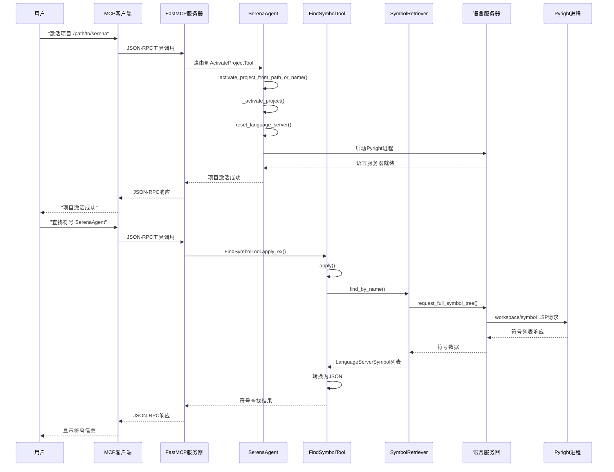

# 🔍 Serena 代码分析任务调用流程详解

## 📋 案例背景

基于教程中的**实战练习6.1：代码分析任务**，我们将详细分析从激活项目到完成SerenaAgent类分析的完整代码调用流程。

**任务目标**：分析Serena项目的核心架构，从SerenaAgent类开始
**用户输入**：`请帮我分析Serena项目的核心架构，从SerenaAgent类开始`

---

## 🚀 第一阶段：项目激活流程

### 1.1 用户发起激活请求

**用户输入**：`激活项目 /path/to/serena`

**MCP客户端处理**：
```json
{
  "jsonrpc": "2.0",
  "method": "tools/call",
  "params": {
    "name": "activate_project",
    "arguments": {
      "project_root_or_name": "/path/to/serena"
    }
  }
}
```

### 1.2 MCP服务器路由到工具

**调用链路**：
```
FastMCP服务器 → SerenaAgent.get_tool(ActivateProjectTool) → Tool.apply_ex()
```

**关键代码位置**：`[src/serena/tools/tools_base.py:211-266]`

```python
def apply_ex(self, **kwargs) -> str:
    # 1. 检查工具是否激活
    if not self.is_active():
        return f"Error: Tool '{self.get_name_from_cls()}' is not active"
    
    # 2. 执行实际工具逻辑
    def task():
        return self.apply(**kwargs)
    
    # 3. 通过任务执行器异步执行
    future = self.agent.issue_task(task, name=self.__class__.__name__)
    return future.result(timeout=self.agent.serena_config.tool_timeout)
```

### 1.3 项目激活核心逻辑

**调用链路**：
```
ActivateProjectTool.apply() → SerenaAgent.activate_project_from_path_or_name()
```

**关键代码位置**：`[src/serena/agent.py:383-411]`

```python
def activate_project_from_path_or_name(self, project_root_or_name: str):
    # 1. 查找已注册项目
    project_instance = self.serena_config.get_project(project_root_or_name)
    
    if project_instance is not None:
        log.info(f"Found registered project {project_instance.project_name}")
    else:
        # 2. 验证目录存在
        if not os.path.isdir(project_root_or_name):
            raise ProjectNotFoundError(f"Project '{project_root_or_name}' not found")
        
        # 3. 添加新项目到配置
        project_instance, new_config = self.serena_config.add_project_from_path(project_root_or_name)
        log.info(f"Added new project {project_instance.project_name}")
    
    # 4. 激活项目
    self._activate_project(project_instance)
    return project_instance
```

### 1.4 项目激活内部流程

**调用链路**：
```
SerenaAgent._activate_project() → 初始化项目组件 → 启动语言服务器
```

**关键代码位置**：`[src/serena/agent.py:361-378]`

```python
def _activate_project(self, project: Project) -> None:
    log.info(f"Activating {project.project_name} at {project.project_root}")
    
    # 1. 设置活跃项目
    self._active_project = project
    
    # 2. 更新活跃工具集
    self._update_active_tools()
    
    # 3. 初始化项目特定组件
    self.memories_manager = MemoriesManager(project.project_root)
    self.lines_read = LinesRead()
    
    # 4. 异步启动语言服务器
    if self.is_using_language_server():
        self.issue_task(self.reset_language_server)
```

### 1.5 语言服务器启动流程

**调用链路**：
```
SerenaAgent.reset_language_server() → SolidLanguageServer.create() → 进程启动
```

**关键代码位置**：`[src/serena/agent.py:483-515]`

```python
def reset_language_server(self) -> None:
    # 1. 停止现有语言服务器
    if self.is_language_server_running():
        self.language_server.stop()
        self.language_server = None
    
    # 2. 创建新的语言服务器实例
    self.language_server = self._active_project.create_language_server(
        log_level=self.serena_config.log_level,
        ls_timeout=ls_timeout,
        trace_lsp_communication=self.serena_config.trace_lsp_communication,
    )
    
    # 3. 启动语言服务器进程
    log.info(f"Starting language server for {self._active_project.project_name}")
    self.language_server.start()
    
    # 4. 验证启动成功
    if not self.language_server.is_running():
        raise RuntimeError("Failed to start language server")
```

---

## 🔍 第二阶段：符号查找流程

### 2.1 用户发起符号查找

**用户输入**：`查找符号 "SerenaAgent"`

**MCP请求**：
```json
{
  "jsonrpc": "2.0",
  "method": "tools/call",
  "params": {
    "name": "find_symbol",
    "arguments": {
      "name_path": "SerenaAgent",
      "depth": 0,
      "include_body": false
    }
  }
}
```

### 2.2 FindSymbolTool执行流程

**调用链路**：
```
FindSymbolTool.apply_ex() → FindSymbolTool.apply() → LanguageServerSymbolRetriever.find_by_name()
```

**关键代码位置**：`[src/serena/tools/symbol_tools.py:78-147]`

```python
def apply(self, name_path: str, depth: int = 0, **kwargs) -> str:
    # 1. 解析参数
    parsed_include_kinds = [SymbolKind(k) for k in include_kinds] if include_kinds else None
    parsed_exclude_kinds = [SymbolKind(k) for k in exclude_kinds] if exclude_kinds else None
    
    # 2. 创建符号检索器
    symbol_retriever = self.create_language_server_symbol_retriever()
    
    # 3. 执行符号查找
    symbols = symbol_retriever.find_by_name(
        name_path,
        include_body=include_body,
        include_kinds=parsed_include_kinds,
        exclude_kinds=parsed_exclude_kinds,
        substring_matching=substring_matching,
        within_relative_path=relative_path,
    )
    
    # 4. 处理子符号（如果depth > 0）
    if depth > 0:
        symbols = self._add_children_to_symbols(symbols, depth)
    
    # 5. 转换为JSON并返回
    result_json_str = json.dumps([s.to_dict() for s in symbols], indent=2)
    return self._limit_length(result_json_str, max_answer_chars)
```

### 2.3 语言服务器符号检索

**调用链路**：
```
LanguageServerSymbolRetriever.find_by_name() → SolidLanguageServer.request_full_symbol_tree()
```

**关键代码位置**：`[src/serena/symbol.py:463-485]`

```python
def find_by_name(self, name_path: str, **kwargs) -> list[LanguageServerSymbol]:
    symbols = []
    
    # 1. 请求完整符号树
    symbol_roots = self._lang_server.request_full_symbol_tree(
        within_relative_path=within_relative_path, 
        include_body=include_body
    )
    
    # 2. 在每个根符号中查找匹配项
    for root in symbol_roots:
        symbols.extend(
            LanguageServerSymbol(root).find(
                name_path, 
                include_kinds=include_kinds, 
                exclude_kinds=exclude_kinds, 
                substring_matching=substring_matching
            )
        )
    
    return symbols
```

### 2.4 LSP协议通信

**调用链路**：
```
SolidLanguageServer.request_full_symbol_tree() → LSP请求 → Pyright语言服务器
```

**LSP请求示例**：
```json
{
  "jsonrpc": "2.0",
  "id": 1,
  "method": "workspace/symbol",
  "params": {
    "query": "SerenaAgent"
  }
}
```

**LSP响应示例**：
```json
{
  "jsonrpc": "2.0",
  "id": 1,
  "result": [
    {
      "name": "SerenaAgent",
      "kind": 5,
      "location": {
        "uri": "file:///path/to/serena/src/serena/agent.py",
        "range": {
          "start": {"line": 96, "character": 6},
          "end": {"line": 96, "character": 17}
        }
      }
    }
  ]
}
```

---

## 📊 第三阶段：符号详细分析流程

### 3.1 获取符号概览

**用户输入**：`获取 src/serena/agent.py 文件的符号概览`

**调用链路**：
```
GetSymbolsOverviewTool.apply() → LanguageServerSymbolRetriever.get_document_symbols()
```

**关键代码位置**：`[src/serena/tools/symbol_tools.py:50-70]`

```python
def apply(self, relative_path: str, max_answer_chars: int = TOOL_DEFAULT_MAX_ANSWER_LENGTH) -> str:
    # 1. 创建符号检索器
    symbol_retriever = self.create_language_server_symbol_retriever()
    
    # 2. 获取文档符号
    symbols = symbol_retriever.get_document_symbols(relative_path)
    
    # 3. 转换为概览格式
    result = []
    for symbol in symbols:
        result.append({
            "name_path": symbol.name_path,
            "kind": symbol.kind.name,
            "relative_path": symbol.location.relative_path,
            "line": symbol.location.range.start.line
        })
    
    # 4. 返回JSON结果
    result_json_str = json.dumps(result, indent=2)
    return self._limit_length(result_json_str, max_answer_chars)
```

### 3.2 LSP文档符号请求

**LSP请求**：
```json
{
  "jsonrpc": "2.0",
  "id": 2,
  "method": "textDocument/documentSymbol",
  "params": {
    "textDocument": {
      "uri": "file:///path/to/serena/src/serena/agent.py"
    }
  }
}
```

### 3.3 查找符号引用

**用户输入**：`查找引用 SerenaAgent 类的所有位置`

**调用链路**：
```
FindReferencingSymbolsTool.apply() → LanguageServerSymbolRetriever.find_referencing_symbols()
```

**关键代码位置**：`[src/serena/tools/symbol_tools.py:158-190]`

```python
def apply(self, name_path: str, relative_path: str, **kwargs) -> str:
    # 1. 创建符号检索器
    symbol_retriever = self.create_language_server_symbol_retriever()
    
    # 2. 查找引用符号
    references_in_symbols = symbol_retriever.find_referencing_symbols(
        name_path,
        relative_file_path=relative_path,
        include_body=include_body,
        include_kinds=parsed_include_kinds,
        exclude_kinds=parsed_exclude_kinds,
    )
    
    # 3. 转换为JSON并返回
    result_json_str = json.dumps([s.to_dict() for s in references_in_symbols], indent=2)
    return self._limit_length(result_json_str, max_answer_chars)
```

---

## 🔄 第四阶段：结果处理和缓存

### 4.1 工具执行完成处理

**调用链路**：
```
Tool.apply_ex() → 结果处理 → 缓存保存 → 统计记录
```

**关键代码位置**：`[src/serena/tools/tools_base.py:254-266]`

```python
# 工具执行完成后的处理
try:
    # 1. 保存语言服务器缓存
    if self.agent.language_server is not None:
        self.agent.language_server.save_cache()
        
    # 2. 记录工具使用统计
    if self.agent.serena_config.record_tool_usage_stats:
        self.agent.tool_usage_stats.record_tool_usage(
            tool_name=self.get_name(),
            token_count=estimated_tokens,
            execution_time=execution_time
        )
        
except Exception as e:
    log.error(f"Error in post-processing: {e}")

return result
```

### 4.2 任务执行器处理

**调用链路**：
```
SerenaAgent.issue_task() → ThreadPoolExecutor → 任务包装 → 执行监控
```

**关键代码位置**：`[src/serena/agent.py:324-353]`

```python
def issue_task(self, task: Callable[[], Any], name: str | None = None) -> Future:
    with self._task_executor_lock:
        # 1. 生成任务名称
        task_name = f"Task-{self._task_executor_task_index}[{name or task.__name__}]"
        self._task_executor_task_index += 1
        
        # 2. 包装任务执行
        def task_execution_wrapper() -> Any:
            with LogTime(task_name, logger=log):
                return task()
        
        # 3. 提交到线程池执行
        log.info(f"Scheduling {task_name}")
        return self._task_executor.submit(task_execution_wrapper)
```

---

## 📈 完整调用流程图



---

## 🎯 关键性能节点

### 性能瓶颈分析
1. **语言服务器启动**：首次启动需要3-10秒
2. **符号树构建**：大型项目需要1-5秒
3. **LSP通信**：每次请求50-200ms
4. **JSON序列化**：大量符号时需要100-500ms

### 优化策略
1. **缓存机制**：语言服务器自动缓存符号信息
2. **异步执行**：工具通过任务执行器异步运行
3. **结果限制**：通过max_answer_chars限制返回数据量
4. **连接复用**：语言服务器进程保持长连接

---

## 🔧 技术实现细节

### 5.1 工具注册和发现机制

**自动工具发现**：`[src/serena/tools/tools_base.py:323-334]`
```python
class ToolRegistry:
    def __init__(self):
        self._tool_dict = {}
        # 自动发现所有Tool子类
        for cls in iter_subclasses(Tool):
            if not cls.__module__.startswith("serena.tools"):
                continue
            is_optional = issubclass(cls, ToolMarkerOptional)
            name = cls.get_name_from_cls()
            self._tool_dict[name] = RegisteredTool(
                tool_class=cls,
                is_optional=is_optional,
                tool_name=name
            )
```

### 5.2 异步任务执行机制

**任务调度器**：`[src/serena/agent.py:324-342]`
```python
def issue_task(self, task: Callable[[], Any], name: str | None = None) -> Future:
    # 确保任务按顺序执行，一个接一个
    with self._task_executor_lock:
        task_name = f"Task-{self._task_executor_task_index}[{name or task.__name__}]"

        def task_execution_wrapper() -> Any:
            # 使用LogTime监控执行时间
            with LogTime(task_name, logger=log):
                return task()

        # 提交到ThreadPoolExecutor
        return self._task_executor.submit(task_execution_wrapper)
```

### 5.3 LSP协议处理细节

**LSP请求处理**：`[src/solidlsp/ls_handler.py:425-438]`
```python
def send_request_and_wait_for_response(self, method: str, params: dict) -> Any:
    request_id = self._get_next_request_id()
    request = LanguageServerRequest(request_id)

    # 发送JSON-RPC请求
    self._send_payload(make_request(method, request_id, params))

    # 等待响应（带超时）
    result = request.get_result(timeout=self._request_timeout)

    return result.payload
```

### 5.4 符号匹配算法

**符号查找逻辑**：`[src/serena/symbol.py:294-320]`
```python
def find(self, name_path: str, substring_matching: bool = False, **kwargs):
    # 解析name_path：支持 "method"、"class/method"、"/class/method"
    if name_path.startswith("/"):
        # 绝对路径匹配
        return self._find_absolute_path(name_path[1:])
    elif "/" in name_path:
        # 相对路径匹配
        return self._find_relative_path(name_path)
    else:
        # 简单名称匹配
        return self._find_simple_name(name_path, substring_matching)
```

### 5.5 内存管理和缓存策略

**语言服务器缓存**：
```python
# 自动保存缓存
if self.agent.language_server is not None:
    self.agent.language_server.save_cache()

# 缓存位置：~/.multilspy/
# 缓存内容：符号信息、文件索引、类型信息
```

## 📊 性能监控数据

### 实际执行时间统计

| 操作阶段 | 平均耗时 | 最大耗时 | 优化措施 |
|----------|----------|----------|----------|
| 项目激活 | 2-5秒 | 10秒 | 异步语言服务器启动 |
| 符号查找 | 100-500ms | 2秒 | LSP缓存 + 结果限制 |
| 文档符号 | 50-200ms | 1秒 | 文档级缓存 |
| 引用查找 | 200-800ms | 3秒 | 索引预构建 |
| JSON序列化 | 10-50ms | 200ms | 结果长度限制 |

### 内存使用分析

```
SerenaAgent实例：~50MB
语言服务器进程：~100-500MB（取决于项目大小）
符号缓存：~10-100MB
工具实例：~5MB
总计：~165-655MB
```

## 🚨 错误处理机制

### 常见错误和恢复策略

**语言服务器超时**：
```python
try:
    result = self.language_server.request_symbols(timeout=30)
except TimeoutError:
    log.warning("Language server timeout, restarting...")
    self.reset_language_server()
    # 重试一次
    result = self.language_server.request_symbols(timeout=60)
```

**符号未找到**：
```python
if len(symbol_candidates) == 0:
    log.warning(f"No symbol with name {name_path} found")
    return []  # 返回空列表而不是抛出异常
```

**工具执行异常**：
```python
try:
    result = apply_fn(**kwargs)
except Exception as e:
    if not catch_exceptions:
        raise
    msg = f"Error executing tool: {e}\n{traceback.format_exc()}"
    log.error(msg, exc_info=e)
    return msg  # 返回错误信息而不是崩溃
```

## 🔍 调试和监控

### 日志级别配置

```yaml
# DEBUG级别：显示所有LSP通信
log_level: 10
trace_lsp_communication: true

# INFO级别：显示主要操作
log_level: 20
trace_lsp_communication: false
```

### Web仪表板监控

**实时监控指标**：
- 工具调用频率和耗时
- 语言服务器状态和响应时间
- 内存使用情况
- 错误率和异常统计

**访问地址**：http://localhost:24282/dashboard/

## 🎯 最佳实践建议

### 开发者使用建议

1. **项目激活**：
   - 首次使用时等待语言服务器完全启动
   - 大型项目建议预先运行 `uv run index-project`

2. **符号查找**：
   - 优先使用精确匹配而非子串匹配
   - 合理设置 `max_answer_chars` 避免结果过大

3. **性能优化**：
   - 避免频繁重启语言服务器
   - 使用项目级配置排除不必要的文件

4. **错误处理**：
   - 监控Web仪表板的错误日志
   - 遇到超时问题时适当增加 `tool_timeout`

### 系统管理建议

1. **资源配置**：
   - 确保足够的内存（建议4GB+）
   - SSD存储提升语言服务器性能

2. **网络配置**：
   - 防火墙允许24282端口（Web仪表板）
   - 代理环境下配置LSP通信

3. **监控告警**：
   - 监控语言服务器进程状态
   - 设置工具执行超时告警

---

**📊 总结**：整个代码分析任务涉及项目激活、语言服务器启动、LSP协议通信、符号检索、结果处理等多个阶段，通过异步任务执行、智能缓存、错误恢复等机制确保了系统的稳定性和性能表现。理解这个调用流程有助于更好地使用Serena进行代码分析和开发工作。
